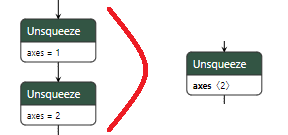

==========================================
python -m experimental_experiment optimize
==========================================

The command line optimizes a model, mostly by fusing nodes maching one of the
patterns defined in this library. One simple example:

The argument of the command lines.

.. runpython::
    :process: 1

    import experimental_experiment._command_lines_parser as pm
    pm.main(["optimize", "--help"])

The list of available patterns.

.. runpython::
    :showcode:

    from experimental_experiment.xoptim import get_pattern_list

    for s in ["default", "ml", "onnxruntime", "experimental"]:
        print()
        print(f"-- {s} patterns")
        pats = get_pattern_list(s)
        for p in pats:
            print(p)
